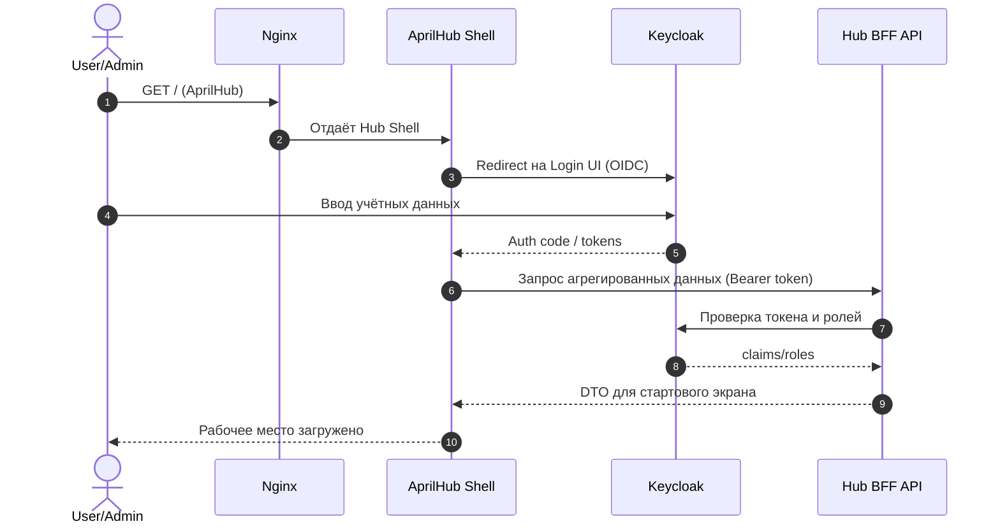
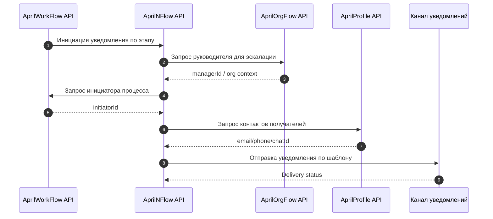
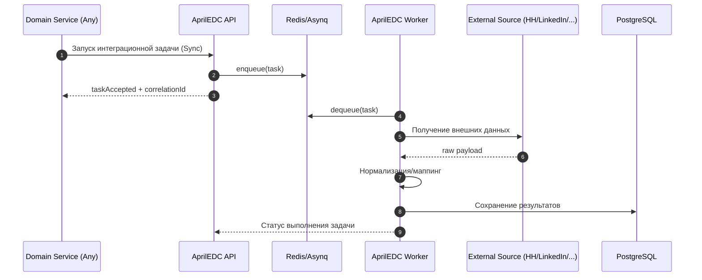
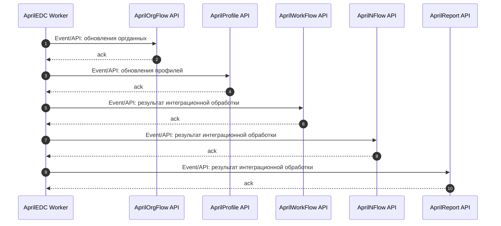
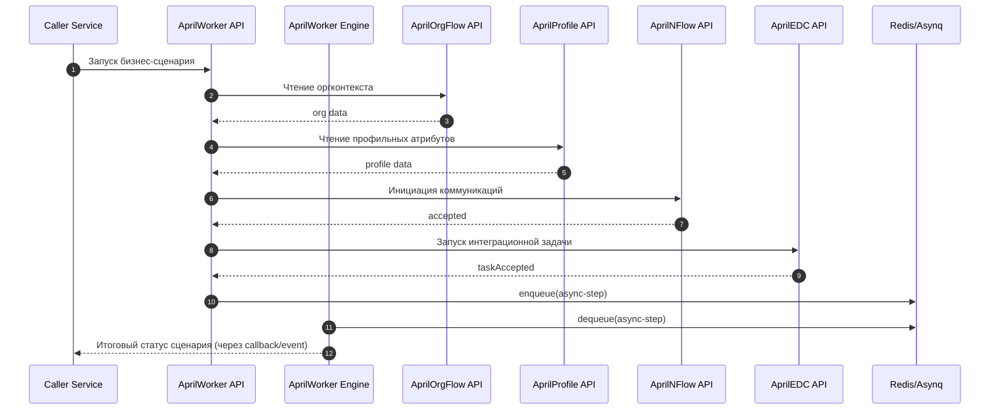

# C4 Runtime Sequences

Документ фиксирует ключевые runtime-сценарии экосистемы April в виде sequence-диаграмм.

Связанные документы:
- `docs/architecture/APRILHUB_C3_C4.md`
- `docs/architecture/APRILWORKER_C3_C4.md`
- `docs/architecture/INTEGRATION_CONTRACTS.md`
- `structurizr/workspace.dsl`

## 1) Вход пользователя через Keycloak и загрузка Hub

**Failure path**
- Если `Keycloak` недоступен: `Hub Shell` показывает страницу недоступности авторизации и не загружает защищённые виджеты.
- Если `Hub BFF` не отвечает вовремя: UI загружается в degraded mode (часть карточек без агрегированных данных).
- При невалидном токене: принудительный re-login через `Keycloak`.

## 2) Эскалационная нотификация в AprilNFlow

Сценарий: триггер не выполнен, `AprilNFlow` должен отправить сообщение руководителю или инициатору процесса.

**Failure path**
- Если `OrgFlow`/`WorkFlow` недоступны: fallback на базовый маршрут уведомления (например, только инициатор или дефолтная группа).
- Если канал доставки недоступен: задача переводится в retry через `NFlow Worker`.
- После превышения ретраев: фиксация failure-статуса и событие для ручной обработки.

## 3) Запуск интеграционной задачи через AprilEDC

Сценарий: доменный сервис инициирует интеграционную задачу.

**Failure path**
- Если внешние источники недоступны: `EDC Worker` повторяет вызов по backoff-политике.
- Если нормализация неуспешна: задача помечается как failed с причиной и correlationId.
- Если БД недоступна: задача возвращается в очередь на отложенный повтор.

## 4) Возврат результатов EDC в доменные сервисы (Async)

**Failure path**
- Если consumer не подтвердил `ack`: событие повторно публикуется (at-least-once).
- При повторных сбоях доставки: событие переводится в проблемный контур (DLQ/failed stream по проектной политике).
- Consumer обязан обрабатывать дубликаты идемпотентно по `eventId`/`entityKey`.

## 5) Сквозной сценарий через AprilWorker

Сценарий: `AprilWorker` координирует бизнес-правило, включает sync-шаги и async-обработку.

**Failure path**
- Ошибка sync-шага: немедленное завершение сценария или запуск компенсации (по критичности шага).
- Ошибка async-шага: retry в `AprilWorker Engine`; при исчерпании — статус `Failed` с причиной.
- Для mutation-операций обязательно идемпотентное повторное выполнение по `scenarioId/correlationId`.
