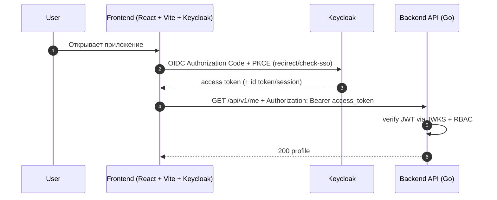
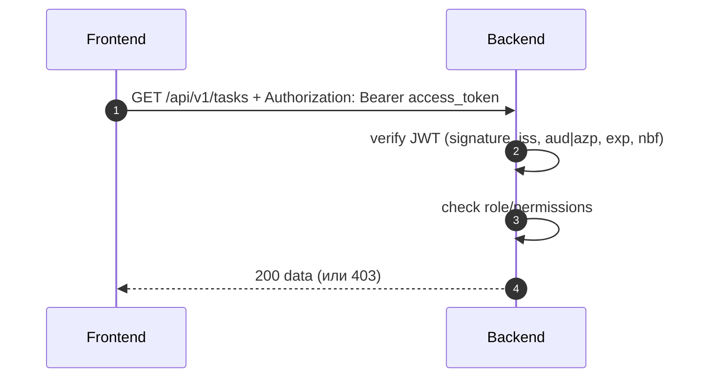
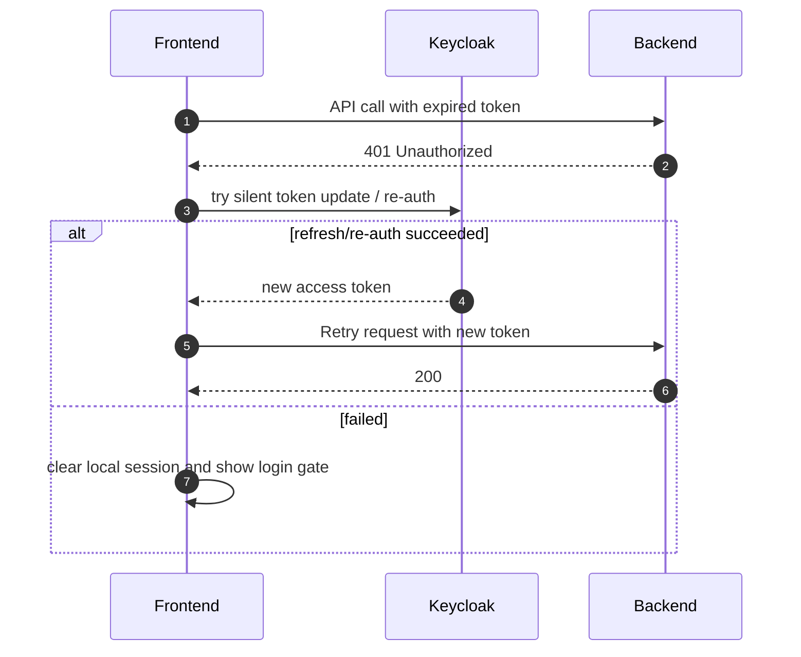
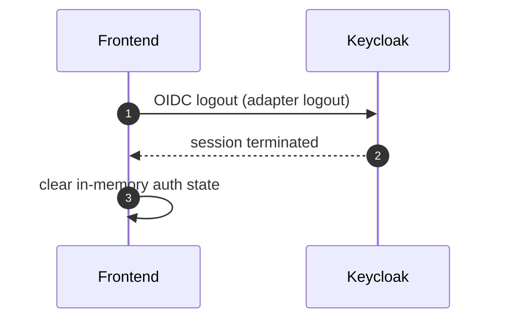

# JWT-аутентификация (адаптация схемы под Keycloak)

Документ согласован с **архитектурным контекстом агента**: IAM — Keycloak; backend — Go, REST, modular monolith; frontend — React + TypeScript + Vite, UI Kit Mantine; инфраструктура — Debian, Docker Compose, Nginx.

## 1. Цель и архитектурная идея

Используется внешняя Identity Provider модель через **Keycloak** (источник RBAC: роли и права), а не локальная выдача JWT backend-ом.

- **Access token** (JWT от Keycloak):
  - получается frontend-ом через OIDC Authorization Code Flow + PKCE;
  - хранится на frontend в runtime-состоянии (через Keycloak adapter / SDK);
  - отправляется в `Authorization: Bearer <token>` к REST API backend;
  - проверяется backend-ом по JWKS (подпись + `iss` + `aud|azp` + срок).
- **Refresh token**:
  - управляется Keycloak сессией и OIDC-механизмами обновления токена;
  - не реализуется в backend как отдельный `/auth/refresh` endpoint;
  - не хранится/ротируется в backend whitelist по `jti`.

Преимущества схемы:

- централизованная аутентификация и lifecycle токенов в IdP (Keycloak);
- backend не хранит секреты пользовательских сессий и не реализует собственный refresh-rotation контур;
- frontend и backend используют стандартный OIDC/JWT/JWKS поток.

**Связь со стеком:** роли из `realm_access.roles` в JWT совпадают с тем, что объявлено в Keycloak как IAM для приложения; UI (Mantine, редактор процессов на React Flow) только передаёт тот же Bearer в API — отдельной схемы auth для «части UI» нет.

---

## 2. Компоненты системы

### Frontend (React + TypeScript + Vite)

- OIDC-клиент: типичная связка **`keycloak-js`** и обёртка для React (например `@react-keycloak/web`), PKCE, `check-sso`, `silent-check-sso` — конкретный пакет задаётся репозиторием.
- **Vite**: публичные параметры Keycloak и base URL API — через переменные окружения с префиксом `VITE_*` (см. §11).
- **Mantine / React Flow (`@xyflow/react`)**: не меняют контракт auth; запросы к API идут с тем же `Authorization: Bearer`, что и для остальных экранов.
- Session / store приложения хранит текущий auth state и профиль (путь к файлу — по структуре репозитория).
- API-клиент добавляет `Authorization: Bearer` и обрабатывает `401/403`.
- `withCredentials` для backend JWT-схемы не является ключевым механизмом auth (основной канал — Bearer).

### Backend (Go, REST, modular monolith)

- Middleware валидации JWT Keycloak (типичное расположение: `internal/middleware/auth.go` или слой `auth` внутри монолита):
  - проверка подписи через JWKS;
  - проверка claims: `iss`, `exp`, `nbf`, `aud|azp`.
- RBAC middleware по ролям realm: `user`, `manager`, `moderator`, `admin`, `superadmin` (набор может быть уточнён в Keycloak).
- Endpoint `GET /api/v1/me` (или эквивалент) для возврата нормализованного профиля текущего пользователя.

### Keycloak (IdP)

- Отдельный realm и clients: public frontend (PKCE) и конфигурация audience для backend.
- Выдача/обновление токенов и SSO-сессии происходит на стороне Keycloak.

### Остальной стек (границы ответственности)

| Компонент | Отношение к user JWT |
|-----------|----------------------|
| **PostgreSQL 17** | Хранение доменных данных; идентификация пользователя в БД обычно по `sub` / email из JWT, не хранение refresh-токена приложением. |
| **Temporal** (Go SDK) | Workflow/activity, инициированные пользователем: при вызовах в REST из activity может потребоваться передача контекста пользователя (token propagation) или отдельный **service account** для машинных сценариев — отдельное проектное решение (ADR). |
| **Redis + Asynq** | Очереди фоновых задач: как правило **не** user Bearer; внутренние учётные данные или отсутствие вызова user-API из воркера. |
| **AprilNflow** | Уведомления: триггеры из backend с user id из доменной модели, не дублирование JWT в очереди уведомлений без необходимости. |
| **Nginx** | Reverse proxy перед API и при необходимости перед Keycloak; TLS termination; rate limit может дублировать/дополнять политики Keycloak. |

---

## 3. Типы токенов и claims

### Access token (runtime-контракт для backend)

Ключевые claims, используемые в backend:

- `sub`: стабильный ID пользователя в Keycloak;
- `email`: email пользователя (если присутствует);
- `iss`: issuer realm;
- `aud` или `azp`: проверка адресата токена;
- `exp`, `nbf`, `iat`: временные ограничения;
- `realm_access.roles`: источник ролей для RBAC (совпадает с политикой IAM в Keycloak).

TTL access token определяется политиками Keycloak realm/client.

### Refresh token

- Существует в OIDC-сессии Keycloak и используется adapter-ом/SDK.
- В backend не декодируется, не whitelist-ится и не ротируется вручную.

---

## 4. Правила хранения токенов

### Access token

- Хранится во frontend runtime-состоянии (не как долгоживущая локальная «сессия приложения» в обход IdP).
- Используется только для вызовов API backend через `Authorization` header.

### Refresh token / SSO cookie

- Управляется Keycloak и его cookie/session механизмами.
- В доменной модели backend отсутствует собственная `refresh_token` HttpOnly cookie приложения.

---

## 5. API-контракты аутентификации

### Что есть

- `GET /api/v1/me` (или согласованный путь)
  - request: `Authorization: Bearer <access_token>`
  - response: профиль текущего пользователя
  - защита: JWT middleware + RBAC (`user` и выше)

Документирование контрактов: **OpenAPI**; решения по auth — **ADR**; диаграммы — **Structurizr (C4)** / **Docusaurus** по процессу команды.

### Что отсутствует в backend (по сравнению с «локальной JWT + refresh cookie» схемой)

- `POST /api/v1/auth/login` — нет (логин в Keycloak).
- `POST /api/v1/auth/refresh` — нет (refresh у Keycloak).
- `POST /api/v1/auth/logout` — нет как единственный источник истины auth (logout выполняется через Keycloak flow).

---

## 6. Последовательность: Login



---

## 7. Последовательность: Доступ к защищенному ресурсу



При истекшем/невалидном access token:



---

## 8. Последовательность: Logout



---

## 9. Поведение фронтенда при 401

Рекомендуемый алгоритм:

1. Если ответ не `401`, ошибка обрабатывается обычным образом.
2. Если `401`, попытаться обновить токен через Keycloak adapter (silent/update token).
3. При успехе — повторить исходный запрос один раз.
4. При провале — очистить session store и отправить пользователя в login flow.
5. Не ретраить бесконечно: использовать `_retry` флаг/guard в API-клиенте.

Исключения:

- запросы к публичным endpoint;
- операции, где повтор небезопасен без idempotency.

---

## 10. Матрица ошибок и реакция

- `401 Missing bearer token`
  - причина: нет `Authorization`;
  - действие FE: пользователь неавторизован, запуск login flow.
- `401 Invalid/expired token`
  - причина: токен невалиден/истек;
  - действие FE: silent update через Keycloak, затем re-login при неуспехе.
- `403 Insufficient role`
  - причина: роль не соответствует RBAC endpoint;
  - действие FE: показать `403`/ограничить действия в UI.

---

## 11. Конфигурация через ENV

**Backend (Go):**

- `KEYCLOAK_URL`
- `KEYCLOAK_REALM`
- `KEYCLOAK_AUDIENCE` (или эквивалентная конфигурация audience/azp проверки)
- `KEYCLOAK_JWKS_URL` (если вынесено отдельно)

**Frontend (Vite):**

- `VITE_KEYCLOAK_URL`
- `VITE_KEYCLOAK_REALM`
- `VITE_KEYCLOAK_CLIENT_ID`
- `VITE_API_BASE_URL`

---

## 12. Ограничения текущей реализации

- Backend зависит от доступности Keycloak/JWKS для корректной валидации токенов.
- В backend нет собственного механизма отзыва refresh-токенов по `jti` (ответственность IdP).
- Клиентская UX-логика при `401` зависит от корректной настройки silent SSO/token update.

---

## 13. Рекомендуемые улучшения (production)

1. Настроить короткий access token TTL + устойчивый silent renew UX.
2. Включить ротацию ключей подписи в Keycloak и мониторинг обновления JWKS-кэша.
3. Логировать auth-deny события с причинами (`no_token`, `invalid_signature`, `expired`, `insufficient_role`) без утечки токена; **сбор логов — Promtail → Loki → Grafana**, метрики API — **Prometheus** (согласно observability-стеку).
4. Добавить rate limit и защиту от brute force на стороне Keycloak и/или Nginx ingress.
5. Документировать incident-процедуру при недоступности IdP.

---

## 14. Краткая state-machine сессии пользователя

```text
UNAUTHENTICATED
  -> (OIDC login success in Keycloak)
AUTHENTICATED(access valid)
  -> (access expired + silent renew success)
AUTHENTICATED(access rotated by IdP)
  -> (renew fail or explicit logout)
UNAUTHENTICATED
```

---

## 15. Mapping: «классическая JWT+refresh cookie» → Keycloak

- `POST /auth/login` (локально) → OIDC login redirect/flow в Keycloak.
- `POST /auth/refresh` (локально) → `updateToken`/silent renew через Keycloak adapter.
- HttpOnly `refresh_token` cookie вашего backend → SSO/session cookie Keycloak.
- Refresh whitelist по `jti` в backend → управление refresh/session на стороне Keycloak.
- `decode_token(expected_type)` в backend → JWT middleware + JWKS + issuer/audience/nbf/exp checks.

Эта адаптация сохраняет сильные стороны JWT-схемы (короткоживущий access, централизованная валидация, предсказуемая обработка 401), но переносит lifecycle refresh-токена из приложения в Keycloak, что соответствует архитектуре с **IAM: Keycloak** и **Go REST monolith + React/Vite frontend**.
